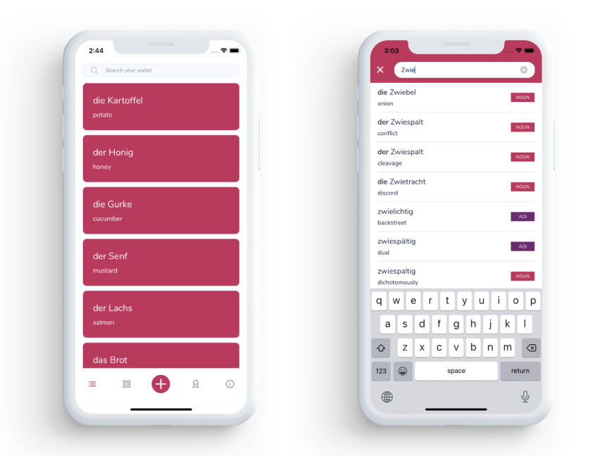
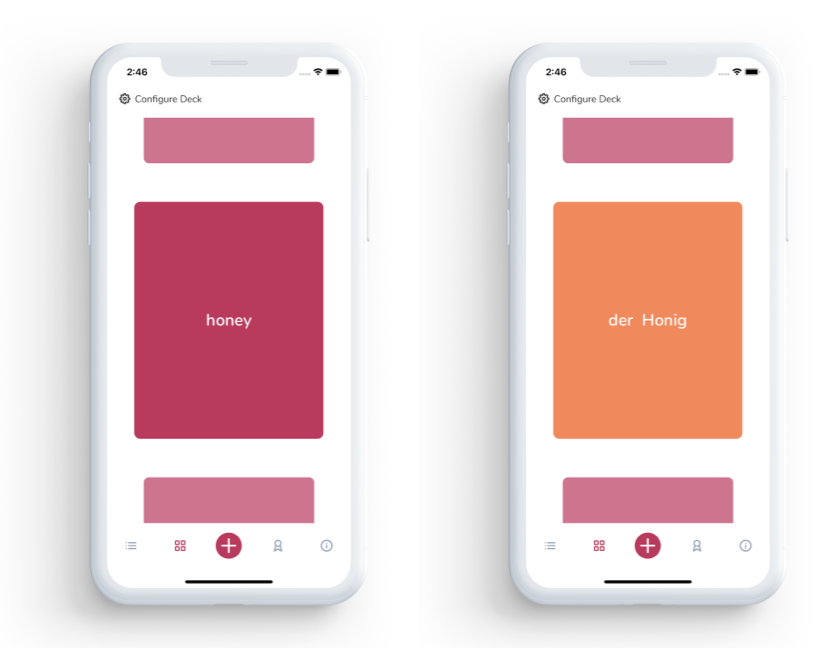

# Flipping Cards

    

Flipping Cards is an iOS/Android app that allows you to learn German words faster by creating flashcards with your own selection of words.

Just add words to your wallet and then you can train your knowledge by generating a card deck.
The app doesn’t require an Internet connection, since the words are stored in the internal dictionary. Adding a new word to your wallet takes just a few seconds and you will be in full control of what to learn.

Flipping Cards is currently only available with German words. Additional languages will be added with future releases.

---

## Main Features:
- All the functionality is available even offline, thanks to the locally stored dictionary
- Super simple UI: add a word in less than 5 seconds!
- Create a deck with a configurable size and with selected "freshness" of the words (e.g. only words added in the last week)
- Test your knowledge of the words by swiping and flipping your cards

---

## Current State:
The app is officially released on [Google Play](https://play.google.com/store/apps/details?id=com.flipcards&pcampaignid=pcampaignidMKT-Other-global-all-co-prtnr-py-PartBadge-Mar2515-1) while the iOS version is currently being reviewed by Apple.

---

## Credits
Flipping cards is built with [React Native](https://reactnative.dev/) and [UI Kitten](https://akveo.github.io/react-native-ui-kitten/).

Illustrations are from [manypixels.co](https://manypixels.co).

---

## Coming soon:
- Challenge mode: test your words knowledge
- Reminders
- Word stats
- Add your words: if a word is not available in the dictionary you will be able to enter it manually

## Coming later :)
- Additional languages
- Pre-made word bundles
- Backup your data in iCloud / Google Drive
