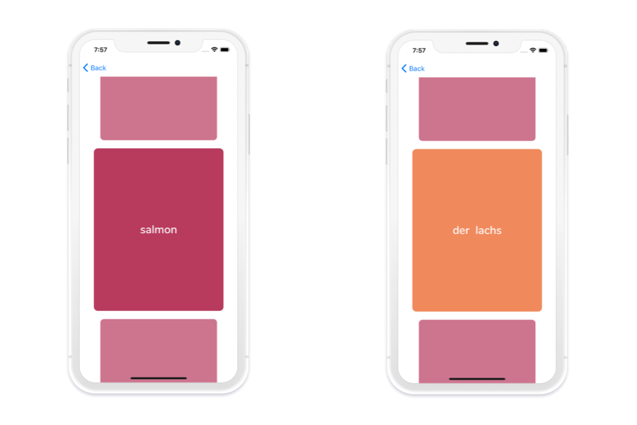

# Flipping Cards

    

Flipping Cards is an iOS/Android app that allows you to learn German words faster by creating flashcards with your own selection of words.

Just add words to your wallet and then you can train your knowledge by organizing these words in cards decks.
The app doesn't require an Internet connection, since the words are stored in the internal dictionary. Adding a new word to your wallet takes just a few seconds and you will be in full control of what to learn.

Flipping Cards is currently only available with German words. Additional languages will be added with future releases.

---

## Main Features:
- All the functionality is available even offline, thanks to the locally stored dictionary
- Super simple UI: add a word in less than 5 seconds!
- Multi decks: organize words coming from your wallet in card decks
- Study words by simply flipping cards in your decks
- Challenge mode: test your knowledge in a quiz-like interface
- Track your learning progress

---

## Download:
- iOS ([download](https://apps.apple.com/us/app/flipping-cards/id1536330032?ign-itsct=apps_box&ign-itscg=30200))
- Android ([download](https://play.google.com/store/apps/details?id=com.flipcards&pcampaignid=pcampaignidMKT-Other-global-all-co-prtnr-py-PartBadge-Mar2515-1))

---

## Credits
Flipping cards is built with [React Native](https://reactnative.dev/) and [UI Kitten](https://akveo.github.io/react-native-ui-kitten/).

Illustrations are from [manypixels.co](https://manypixels.co).

---

## Coming soon:
- Reminders
- Add your words: if a word is not available in the dictionary you will be able to enter it manually

## Coming later :)
- Additional languages
- Pre-made word bundles
- Backup your data in iCloud / Google Drive
